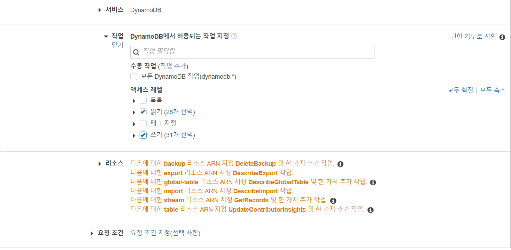
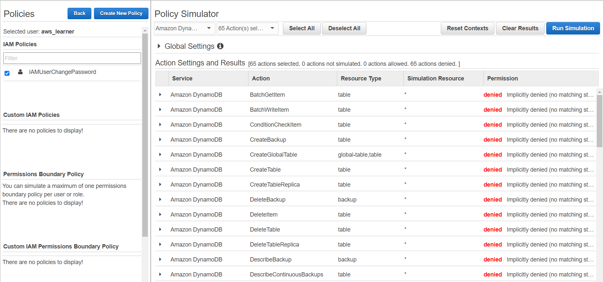
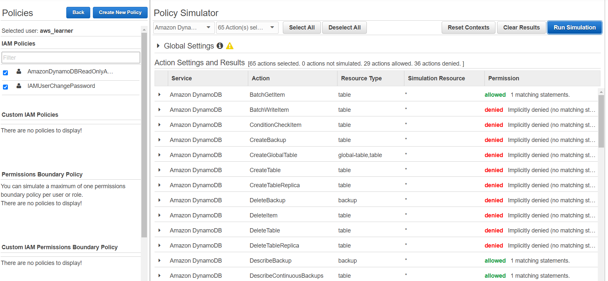

## IAM

***

### IAM이란??

+ 유저를 관리하고 접근 레벨 및 권한에 대한 관리
+ 접근키(Access key)와 비밀키(Secret Access Key)
+ 매우 세밀한 접근 권한 부여 기능 (Granular Permission)
+ Mulit-Factor Authentication (다중 인증) 기능 제공
    + 이걸 우리는 MFA 라고 부른다.

아래와 같은 요소들이 IAM에 포함된다.

+ 그룹
+ 유저
+ 역할
+ 정책

IAM은 Regional 하지 않고 Universal 하다.  
따라서 지역에 따라 설정을 다르게 해줄 필요가 없다. 

### IAM의 정책 시뮬레이터

정책 시뮬레이터를 왜 사용할까??

+ 개발환경에서 실제환경으로 빌드하기전 IAM 정책이 잘 작동되는지 
테스트 하기 위함
  
+ IAM과 관련된 문제들을 디버깅하기에 최적화된 툴 (이미 실제로 유저에
  부여된 다양한 정책들도 테스트 가능)
  
***

AWS에서 작업할때, 루트 사용자 계정을 사용하지 않을 것을 강력히 권장한다고
한다. 가장 모범 사례는 첫 1회만 루트 사용자로 로그인하여 IAM 계정을
생성하는 것이고, 그 이외에는 접근하지 않는 것이라고 한다. 

### 실습 :

+ aws_learner라는 사용자를 새로 만들었다.
  + 강의 내용과 달랐던 점은, aws에서 새로 SSO(Single Sign on)
  이라는 기능을 제공하는 것 같았다. IAM Center에서 중앙 관리를 해준다는데,
  일단은 강의와 다른 점을 최대한 만들지 않기 위해 사용하지 않았다.
  추후에 따로 공부해보겠다.
    
+ aws_learner_group 이라는 그룹을 새로 만들었다.
  + 해당 그룹에 많은 정책을 추가할 수 있는데, 실습에서는 아무런 정책도
  추가하지 않았다. 
    
+ (유저)역할
  + 강의에서는 역할은 별로 중요하지 않다고 설명한다. 오히려 역할보다는
  정책이 더 중요하며, 그렇기에 바로 정책으로 넘어가겠다고 설명한다.
    
+ 정책
  + 정책 탭에서 정책 추가를 눌러 아마존이 지원하는 수 많은 정책들을 
  조회할 수 있고, 그 중에서 우리는 ***DynamoDB***를 선택했다.
    
  실습에서 위와 같이 읽기 권한과 쓰기 권한을 부여하고, 리소스는
  모든 리소스를 허용했다.
  + 정책은 2가지 종류가 있다고 한다.
    > #### 자격 증명 기반 정책
    > 정책을 생성 후 유저를 생성할 때 정책을 적용할 수 있음  
    즉 정책을 사용자, 그룹 또는 역할에 연결한다.  
    ***우리가 일반적으로 말하는 IAM 정책이 여기에 해당한다.***
    > 
    > #### 리소스 기반 정책
    > 정책을 리소스에 연결한다.  
    예를 들어 S3의 버킷 정책, VPC 엔드 포인트 정책이 있다.  
    해당 정책을 사용하면 리소스에 액세스할 수 있는 대상 및 그 대상이
     리소스에서 수행할 수 있는 작업을 지정할 수 있다.
    
+ 정책 시뮬레이터 (유저의 권한 x)
  + 위에서 만든 사용자와 그룹, 정책을 테스트해볼 수 있다.
  + IAM 대시보드 -> 도구 -> 정책 시뮬레이터로 들어간다.
  + 좌측에서 사용자를 선택하고, 우측에서 서비스와 액션을 선택한다.
    + 서비스로는 위와 동일하게 DynamoDB를, 액션으로는 테이블 생성,
  삭제를 포함한 모든 행위를 추가한다.
  + 새로 만들어준 유저는 아무런 권한이 없기 때문에, 결과는 다음과 같다.
  
    
+ 정책 시뮬레이터 (유저의 권한 O)
  + 이번에는 유저에게 권한을 추가하고 시뮬레이션 해보았다.
  + IAM 대시보드 -> 사용자 -> "사용자" -> 권한 추가 -> 직접 정책 연결에서
  아마존이 미리 만들어둔 DynamoDB read-only 정책을 추가한다.
    
  정책을 추가한 뒤 시뮬레이션 결과는 다음과 같다.
  몇몇 서비스들이 허용된 것을 확인할 수 있다.