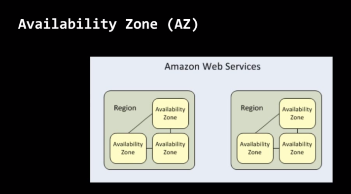
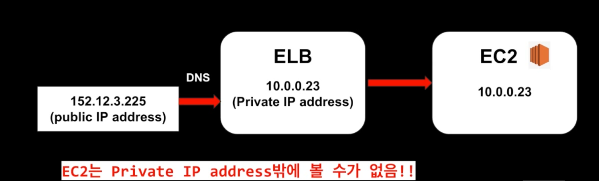
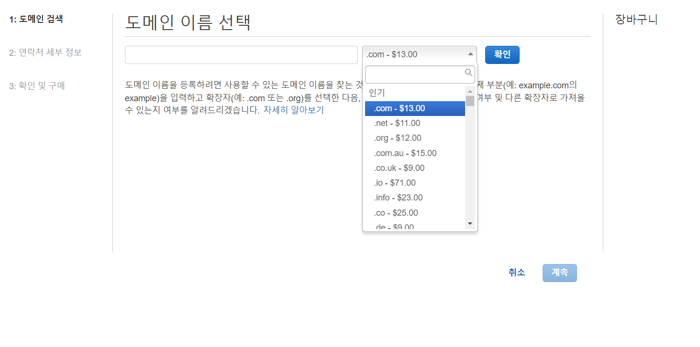

## EC2
Elastic Compute Cloud

***

EC2는 우리가 인스턴스를 끄거나 켤 수 있으며, 켰을 때만 돈을 지불한다.

여담으로, 다양한 지불 방법이 존재한다.

+ on-demand : 시간 단위로 가격이 고정되어 있음
+ Reserved : 한정된 EC2 용량 사용 가능, 1-3년동안 시간별로 할인 적용
  + on-demand와 달리 용량이 한정되어 있어 유연성이 떨어짐
+ Spot : 입찰 가격 적용, 가장 큰 할인률을 적용받음
    + 인스턴스의 시간과 끝기간이 전혀 중요하지 않을때 매우 유용함
    
on-demand : 개발 기간이 정해져있지 않고 사용 용량 또한 정해지지 않은
불규칙적인 상황에서 이용하기 적합

Reserved : 개발 기간이 어느정도 정해져있고, 사용 용량 또한 어느 정도
정해져있는 상황에서 싼 가격으로 이용할 수 있음

Spot : "나는 이 정도의 가격을 지불하고 EC2를 사용하고 싶습니다." 
하지만 지금의 가격은 이것보다 높으니 지금은 인스턴스를 사용할 수 없다.
그러나 시간이 흘러 처음에 설정했던 가격에 도착하게 될 경우 인스턴스를
사용할 수 있게 됨

***

### EBS

EC2를 사용하기 위해 EBS라는 디스크 볼륨이 요구된다.

+ EBS (Elastic Block Storage)
  + 저장 공간이 생성되어지며 EC2 인스턴스에 부착된다.
  + 디스크 볼륨 위에 File System이 생성된다.
  + EBS는 특정 Availability Zone(AZ)에 생성된다.
    + AZ란?
      + 일종의 Disaster Recovery
      
      + 이렇게 Region 안에 AZ 들이 있으며 특정 서비스를 사용할 시
      위 처럼 AZ를 설정해주어야 한다.
        
+ EBS 볼륨 타입은 SSD, HDD가 있는데, 일단은 넘어가겠다.

***

### ELB

EC2와 많은 관련이 있어서 묶여서 종종 함께 쓰인다.

***ELB (Elastic Load Balancer)***

+ 수많은 서버의 흐름을 균형있게 흘려보내는데 중추적인 역할
+ 하나의 서버로 traffic이 몰리는 병목현상을 방지
+ Traffic 흐름을 더 잘 처리할 수 있는 인스턴스로 옮김

#### ELB는 종류가 많이 있다.

+ ***Application Load Balancer***
  + OSI Layer7에서 작동한다. (Application Layer)
  + HTTP, HTTPS와 같은 traffic의 load balancing에 가장 적합 
  
+ ***Network Load Balancer***
  + OSI Layer4에서 작동한다. (Network Layer)
  + 극도의 Performance가 요구되는 TCP 트래픽에 적합
  + 초당 수백만개의 요청을 미세한 딜레이로 처리 가능
  + 큰 서버에 적합한 로드 밸런서
  
+ classing Load Balancer
  + 시험에는 엄청 많이 나온다고 한다
  + 하지만 나는 시험을 준비하지 않으니 넘어가도록 하겠다.
  
#### X-Forwarded-For 헤더

EC2는 private Ip address밖에 보지 못한다고 한다.  
여기서 EC2가 public Ip를 알아낼 수 있게 해주는 것이 
x-forwarded-for 헤더이다.

***

### EC2 - Route53

Route53는 뭐하는 녀석일까

***AWS에서 제공하는 DNS 서비스***

+ EC2 instance
+ S3 Bucket
+ Load Balancer

즉, ***도메인 주소를 구매하여 위 3가지 back-end로 연결시켜주는 녀석이다.***

영상에서는 바로 실습으로 들어간다.

***Route53 -> DNS 관리 -> 호스팅 영역 생성***에 들어가면 아무것도 없다.  
도메인 생성을 하지 않았기 때문! 따라서 도메인을 먼저 등록해준다.

***등록된 도메인 -> 도메인 등록***

이렇게 돈을 주고 도메인을 살 수 있다. 끝부분에 따라 가격이 다르게
책정된다. 

> 학습용이라 실제로 구매하지는 않을 것이기에, 글로서 설명하자면
해당 화면에서 이름과 끝부분을 선택하면 중복되는 도메인은 없는지 
유효설 검사를 하는 부분이 나온다. 유효성 검사를 통과해서 다음 버튼을
누르면 도메인 구매자?에 대한 세부 정보 입력 란이 나오며, 작성 완료 후
> 넘어가면 이메일 검증과 도메인 자동 갱신 여부를 선택할 수 있다.

도메인 등록을 마친 후 우측에 "대기 중인 요청"으로 들어가면 최대 3일간
방금 등록했던 도메인이 등록을 대기중이며, 이후 등록이 처리되면 도메인을 
정상 이용할 수 있다.

***

### EC2 접속

실습에서는 Putty를 사용해서 원격 서버에 접속한다고 한다.
