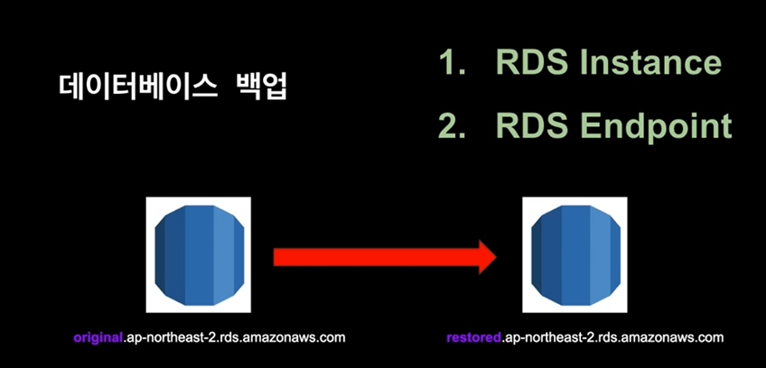
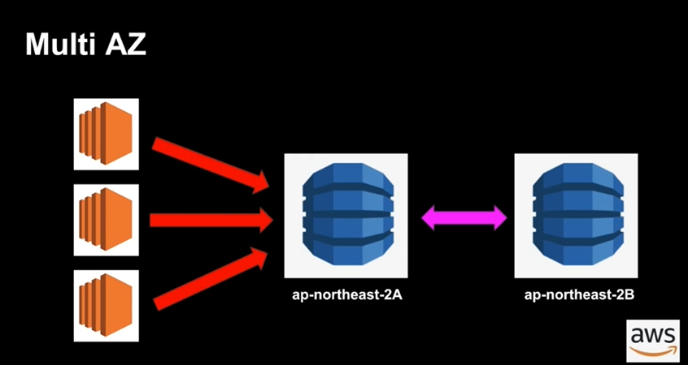
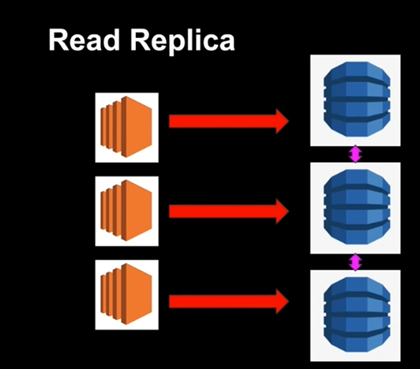

## RDS

Relational DB Service

***

관계형 데이터베이스에 대한 설명은 넘어가도록 하겠다.

### Data warehousing

+ 엄청난 양의 데이터를 불러올때 사용되는 빅데이터이다.
+ 어떤 목적을 위해 데이터를 분석할때 사용된다. 
+ Business Intelligence에서 주로 사용됨
+ 보통 서로 다양한 소스로부터 데이터가 합쳐지며, 필요시 불러와진다.
+ 따라서 Transaction processing에는 적합하지 않다.

### OLTP와 OLAP

+ OLTP (Online Transaction Processing)
    + INSERT와 같이 종종 사용되어지는, 혹은 규모가 작은 데이터를
      (실시간으로) 불러올때 사용
    + 흔히 말하는 "트랜잭션 처리"를 OLTP라고 부른다.
        + ex) Order # 210번에만 해당하는 정보를 가져오는 쿼리
      
+ OLAP (Online Analytical Processing)
    + 매우 큰 데이터를 불러올때 사용
    + 주로 대용량의 Select 문을 통한 데이터 스캔이 주가 된다. 데이터의
    양이 너무 방대하기 때문. INSERT/UPDATE가 수행되는 OLTP와 대조된다.
      
***

### RDS - Database Backups

RDS에는 2가지 백업 방법이 존재한다.

+ Automated Backups (자동 백업)
+ DB Snapshots (데이터베이스 스냅샷)

#### Automated Backups (AB)

+ Retention Period (1 - 35일) 안의 어떤 시간으로 돌아가게 할 수 있음
+ AB는 백업 희망일에 생성된 스냅샷과 Transaction logs(TL)을 참고함
+ 디폴트로 AB 기능이 설정되어 있으며 백업 정보는 S3에 저장
  + 여기서 S3는 RDS 용량 만큼은 제공이 된다. 물론 초과하면 과금이 된다.
  + 만약 10GB만큼 RDS를 할당했다면, 10GB 만큼의 S3가 제공된다.
+ AB동안 약간의 I/O suspension이 존재할 수 있음 -> Latency
    + 즉 S3 버킷에 데이터를 저장하는 동안에는 약간의 딜레이가
    존재하게 된다.
우리는 이걸 ***PIT(Point In Time)*** 이라고 부름

#### Database Snapshots

카메라가 어떤 사진을 저장하기 위해 사진을 찍듯, 데이터베이스도
데이터를 저장하기 위해 스냅샷을 찍는 것.

+ 주로 사용자에 의해 실행됨
+ 원본 RDS Instance를 삭제해도 스냅샷은 존재함
    + 앞에서 살펴본 AB의 경우는 인스턴스를 삭제하면 백업도 없어진다.
    
***

백업된 데이터베이스의 경우 사진과 같이 식별할 수 있다.  
원본의 경우 original이 붙은 반면 복원된 데이터베이스는 restored가 붙는다.
시험에 종종 언급된다고 하는데 넘어가겠다.

***

### RDS - Multi AZ, Read Replicas

#### Multi AZ

+ Mutli Availablility Zone
+ 원래 존재하는 RDS DB에 무언가 변화가 생길때 다른 AZ에 똑같은 
복제본이 만들어짐 = Synchronize
  
+ AWS에 의해서 자동으로 관리가 이루어짐 (No admin intervention)
+ 원본 RDS DB에 문제가 생길 시 자동으로 다른 AZ의 복제본이 사용됨
+ #### ***Only For Disaster Recovery***
    + 만약 성능이 개선이 목적이라면 Read Replica를 사용해야 한다.

어떤 EC2 인스턴스가 2A에 쓰기 작업을 실행한다면, 이는 2B에도 반영이 된다.  
2A에 문제가 생긴다면 RDS는 자동으로 2B로 전환한다.

#### Read Replica

+ Production DB의 읽기 전용 복제본이 생성됨
    + 쓰기 목적도 가지는 Multi AZ와 다르게 읽기만 가능하다.
+ 주로 Read-Heavy DB 작업시 효율성의 극대화를 위해 사용됨
+ ***Disaster Recovery 용도가 아니다.***
+ 하나의 RDS에서 최대 5개의 Read Replica DB 허용
+ Read Replica의 Read Replica 생성 가능 (단, 약간의 딜레이 존재)

위 사진과 같이 EC2 인스턴스가 RDS에 읽기 요청을 많이 보낼때, 우리는
RDS의 복제본 Read Replica에 각각의 인스턴스를 연결하여 성능향상을
기대할 수 있다.

***

### Elastic Cache

Elastic Cache는 RDS와 관련된 기능은 아니지만, 함께 사용하면
좋은 시너지를 기대할 수 있다.

+ 클라우드 내에서 In-memory 캐시를 만들어준다.
+ 즉 클라우드에 메모리를 상주시키고 캐시로 활용할 수 있게 해준다.

Elastic Cache에는 2가지 타입이 있는데, Memcached와 Redis이다.

#### Memcached
+ Object 캐시 시스템으로 알려져있다.
+ Elastic cache는 Memcached의 프로토콜을 디폴트로 따른다.
+ ***EC2 Auto Scailing 처럼 크기가 커졌다 작아졌다 한다.***
    + 데이터 처리 사용량이 많으면 캐시를 늘려준다.
+ 오픈 소스

***언제 Memcached를 사용해야 할까??***

+ 가장 단순한 캐싱 모델이 필요할때
+ Object caching이 주된 목적일때
+ 캐시 크기가 자동으로 scaling 되기를 원할때

#### Redis

+ Object가 아닌, 조금 더 정교한 데이터를 저장한다.
    + Key-Value, Set, List
    
+ 오픈 소스
+ Multi AZ 지원
    + 즉, Disaster Recovery 지원
    
***언제 Redis를 사용해야 할까??***

+ List, Set과 같은 데이터셋을 사용할 때
+ 리더보드처럼 데이터셋의 랭킹을 정렬해야 할 때
+ Multi AZ 기능이 필요할 때

