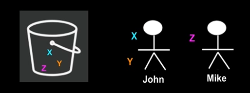

## S3

***

S3는 Simple Storage Service의 약자이며, AWS에서 처음으로 launching한 서비스이다.

S3는 다음과 같은 기능을 제공한다.

+ 안전하고 가변적인 Object(이미지, 동영상 등) 저장 공간을 제공
    + Object이기 때문에 운영체제 등은 저장할 수 없다고 한다.
+ 편리한 UI 인터페이스를 통해 어디서나 쉽게 데이터를 저장하고 불러올 수 있음
+ 파일 크기는 0KB부터 5TB까지 지원한다.
+ 저장공간 무제한
    + 저장공간이 가변적이기 때문에 user level에서는 무제한처럼 보인다.
+ Bucket이라는 이름을 사용함
    + Bucket은 디렉토리와 비슷한 개념
+ Bucket은 보편적인 namespace를 사용함

***

### S3의 구성요소

+ Key
+ Value
+ Version ID
+ MetaData
+ CORS (Cross Origin Resource Sharing)
    + 한 Bucket의 파일을 다른 Bucket에서 접근할 수 있게 해주는 구성요소
    
### S3 Data Consistency Model

+ Read after Write Consistency (PUT)
    + 우리는 S3 버켓에 데이터를 올릴때 PUT을 통해서 업로드한다.
    + 파일이 S3 버켓에 올라가면 우리는 그 파일을 즉시 사용할 수 있다.
    
+ Eventual Consistency (UPDATE, DELETE)
    + UPDATE, DELETE를 사용하여 Bucket에 올라간 데이터를 수정할 시
    그 결과가 바로 나타나지 않음
    

> 강의에서 설명을 좀 개떡같이 했는데, 개인적으로 공부한 내용을 다시 정리하겠다.  
> 데이터 일관성이란, 같은 시간에 조회하는 데이터는 항상 동일한 데이터임을
> 보증하는 것을 말한다.
> 
> 가령, 내가 S3에 파일을 업로드 하자마자 그 파일을 조회한다고 가정하면,
> S3가 파일을 업로드하느라 아직 올린 파일이 반영이 되지 않아 빈 결과를
> 반환하게 된다. 분명히 ***파일을 넣었음에도 불구하고***.
> 
> 이런 경우가 데이터 일관성이 없는 경우이다.  
> 여기까지 이해하고, 위의 내용을 다시 봐보자.  
> S3는 ***Read after Write Consistency에 의해 PUT동작에 대해서는
> 일관성을 보장해준다.***
> 
> 하지만 UPDATE/DELETE 동작에 대해서는 일관성을 보장해주지 않는다.
> 파일을 삭제하거나 업데이트하게 되면, 일정 시간 후에 결과가 반영되게 된다.
> (1초 미만의 시간 후)

***

### S3 - 2부

S3에는 다양한 스토리지 타입이 존재한다.

+ 일반 S3
+ S3 - IA (Infrequent Access)
+ S3 - One Zone IA
+ Glacier
+ Intelligent Tiering

#### 일반 S3

+ 가장 보편적으로 사용되는 스토리지 타입
+ 높은 내구성, 가용성
    + 내구성이란 얼마나 데이터가 잘 보존되는가
    
#### S3 - IA

+ 자주 접근되지는 않으나 접근시 빠른 접근이 요구되는 파일이 많을시 유용
+ 일반 S3에 비해 비용은 저렴하지만 접근시 추가 비용이 발생된다.
    + 따라서 데이터 접근이 잦은 경우 적합하지 않다.
+ 멀티 AZ를 통한 데이터 저장
    + 이로 인해 가용성이 높다.
    + 어떤 AZ가 down되어도 다른 AZ는 사용 가능하기 때문
    + 그래서 IA가 더 비싸다
    

#### S3 - One Zone IA

+ 단일 AZ를 통한 데이터 저장
+ 단일 AZ에 의한 데이터 접근 제한
    + 따라서 IA보다 가용성이 낮다.
    + 만약 특정 AZ가 down된다면 그 S3에는 접근이 불가능하기 때문
+ 데이터 접근시 S3 - IA보다 20%의 비용이 저렴하다.

#### Glacier

+ 거의 접근하지 않을 데이터 저장 시 유용함
+ 매우 저렴한 비용
+ 데이터 접근시 대략 4-5시간 소요
+ Glacier는 빙하라는 뜻이며, 데이터를 빙하의 한가운데 얼려놓는 개념이다.

#### Intelligent Tiering

+ 데이터 접근 주기가 불규칙할때 매우 유용
+ 2가지 티어가 존재함
    + Frequent Tier
    + Infrequent Tier
+ 데이터 접근 주기에 따라 두가지 티어 중 하나로 선택됨
+ Frequent Tier가 비용이 약간 더 비쌈
+ 최고의 비용 절감 효율을 누릴 수 있음

***

### S3 요금

+ GB당 과금
    GB당 0.023 USD 정도
+ PUT, GET, COPY 요청 횟수당
+ 데이터 다운로드시 / 다른 리소스로 전송시
+ Metadata (Object tag)
    + 어떤 오브젝트가 특정 태그가 걸려있다면, 추가적이 비용이 발생한다.
+ 스토리지 타입에 따라

***

### S3 버켓 생성시 알아야 할 것들

#### S3의 사용 용례

+ 파일 저장소 (로그, 다양한 파일들(이미지, 비디오, 압축파일 등))
+ 웹사이트 호스팅
    + 이건 System Architecture 교수님께서 말씀하신 기능인듯 하다.
    + Route53을 활용해서 도메인을 S3 Bucket에 사용할 수도 있다고 한다.
+ #### ***CORS***
    + 버켓 A에서 버켓 B에 있는 데이터에 접근하는 것이 가능한게 CORS 덕분이다.
    
    
또한 S3에서는 특정 파일이 업로드될 시 이를 트리거 하여 EC2나 RDS 등
다른 인스턴스에서 특정 동작을 수행하게 하는 것도 가능하다고 한다.

우리가 최초 S3 버켓을 생성하게 되면 생성자에게만 공개되고, 나머지 모두에게
비공개로 설정된다.
여기서 특정 사람에게만 접근 권한을 주고싶다면, 2가지 방법이 있다.

+ 버켓 정책 변경(Bucket Policy)
    + 버켓 정책을 public으로 바꾸면 된다.
    + 버켓 정책은 JSON 형식이다.
+ 접근 제어 리스트 변경 (Access Control List)
    + 버켓 정책 변경 방식과 다르게 파일 하나하나에 접근 권한을 다르게 할 수 있다.
    
    + 좌측이 버켓 정책 변경, 우측이 접근 제어 리스트 변경이다.  