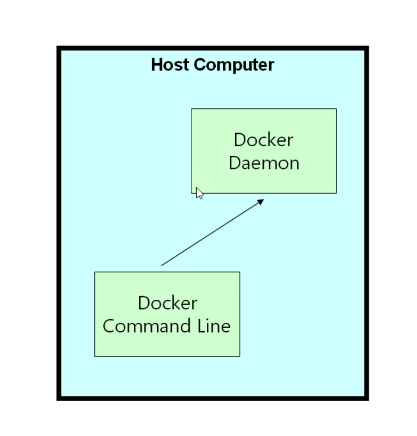
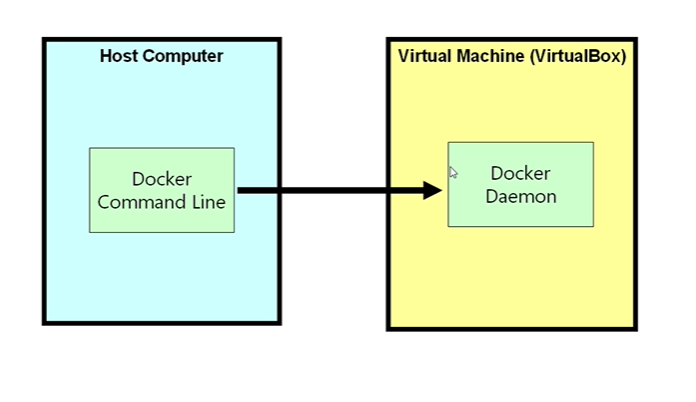
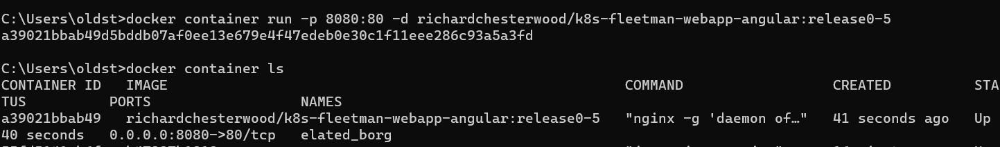
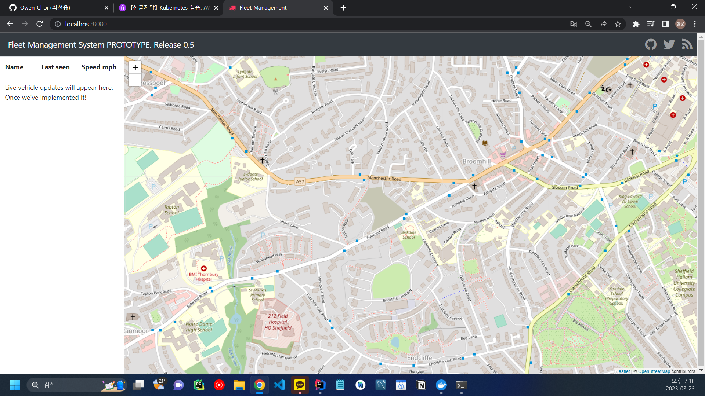

## 도커

***

도커를 왜 쓰나요?? 아주 간단한 요약

+ 애플리케이션을 실행하기 위해 필요한 실행환경을 이미지화 시켜서
컨테이너를 통해 대신 실행함 -> 어떤 환경에서도 실행 가능

### 이미지와 컨테이너

+ 이미지는 컨테이너의 Definition
  + 이미지를 실행시킨다 == 컨테이너로 만든다
  + 즉 이미지를 만들고, 그걸 실행시키기 위해 컨테이너로 만든다.

도커를 실행시키는 과정은 다음과 같다.  
+ Docker CommandLine에서 명령어 실행
+ 백그라운드에서 돌고있는 Docker Daemon이 Docker 서버와 통신
    + Docker Daemon은 Linux 환경에서 돌아가야 한다. 하지만 우리는
    윈도우 환경에서 리눅스를 실행한다.
      
    + 따라서 다음과 같은 형태로 도커가 구동된다.
    
      
    + 리눅스에서 실행되어야 하는 Docker Daemon은 VM 기반으로
    동작한다.
      
***

실습으로 들어가자.

먼저 도커 허브에 있는 실습 프로젝트인  
richardchesterwood/k8s-fleetman-webapp-angular 를 pull 받는다.

> docker pull richardchesterwood/k8s-fleetman-webapp-angular:release0-5

pull을 통해서 이미지를 받아왔으면, 실행하도록 한다. (컨테이너로 만들기)

> docker container run -p 8080:80 -d richardchesterwood/k8s-fleetman-webapp-angular:release0-5

run -p 80:80은 다음과 같은 이유로 붙여준다.
+ 이미지가 nginx를 사용하기 때문에 80번 포트로 실행하여야 한다.
+ ***콜론의 왼쪽에 존재하는 포트는 외부 환경에 노출시킬 포트를 의미한다.***
  + 해당 부분에는 우리가 원하는 어떤 숫자든 입력할 수 있다.
  + 하지만 내부적으로는 콜론의 오른쪽에 있는 포트로 트래픽이 몰리게 된다.
  
또한 포트 뒤에 옵션 -d는 다음과 같은 이유로 붙여준다. 
+ 백그라운드 실행
  + 해당 옵션이 없으면 터미널은 해당 프로세스로 인해 사용할 수 없음

참고 : 위 명령어를 실행했을때, 호스트 pc에 이미지가 없다면 자동으로
pull을 받은 뒤 진행한다. 따라서 pull 명령어는 필수가 아니다.

실행 결과는 다음과 같다.

여기까지 실행하면 localhost:8080을 입력해 웹에 접근할 수 있다.
> ### 강의에서는 이 시점에서는 웹에서 접근할 수 없다.
> 강의에서는 minikube를 독자적으로 설치하고 vm 안에서 minikube를
> 구동하는데, 나의 경우는 도커를 통해 로컬호스트에서 미니큐브를
> 실행하기 때문에 현 시점에서 웹사이트에 바로 접근이 가능한 것이다.
> 
> ***강의에서는 미니큐브가 구동되고 있는 vm의 IP 주소를 알아낸다.***  
> 그 후 해당 아이피 주소 : 8080을 통해 컨테이너로 실행한 웹서비스에 접근한다.  
> 미니큐브의 아이피 주소는 ***minikube ip*** 명령어로 알아낼 수 있고, 
> 나의 경우는 이 명령어의 결과로 localhost, 즉 127.0.0.1이 반환되므로
> 현재 웹 서비스를 실행할 수 있는 것!

컨테이너를 통해 실행한 웹서비스의 화면은 다음과 같다.

핵심은, ***우리는 Nginx, Angular 등을 설치하지 않고도 웹 서비스를
정상적으로 실행할 수 있었다는 것이다.***

