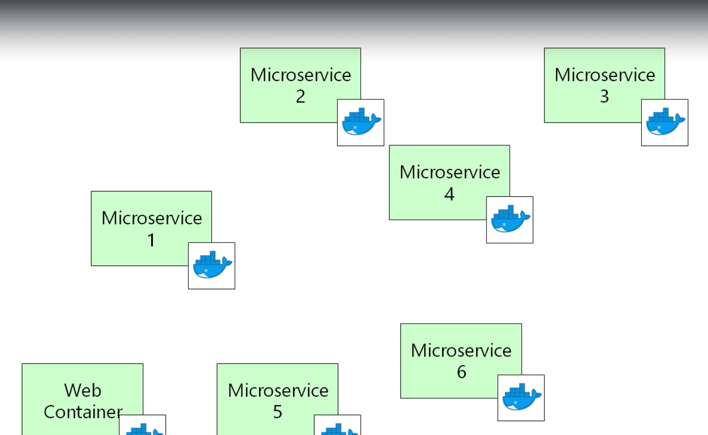
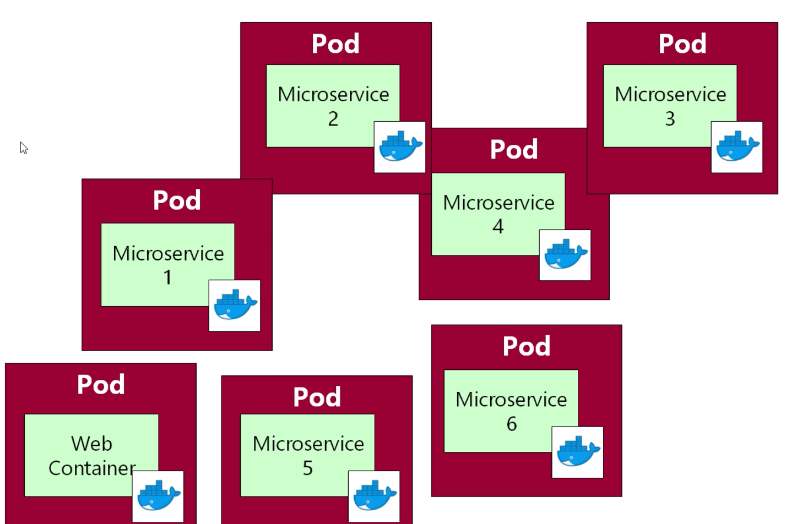
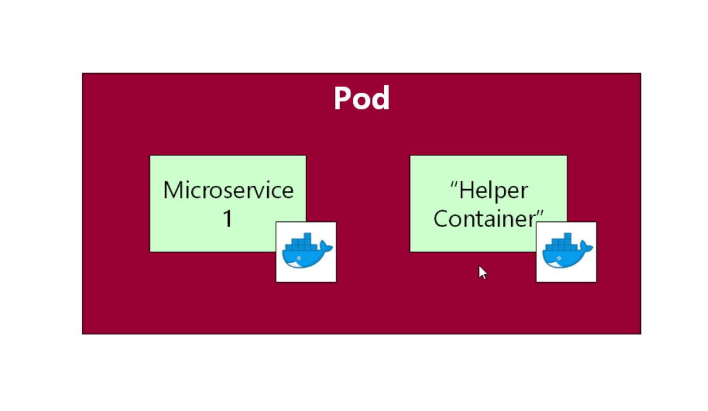

## 쿠버네티스 파드

***

Pod는 쿠버네티스의 가장 기본적인 개념 중 하나이다.  
가장 기본적이지만 설명하기는 어렵다.

파드의 정의는 다음과 같다.  
***두개 이상의 컨테이너로 이루어진 그룹***

파드에 대해서 더 설명하기 전에, 우리의 목표는 마이크로 서비스 
아키텍쳐를 클라우드 환경에 배포하는 것이다.  

위와 같이 web container를 비롯한 여러개의 마이크로 서비스가 있다고
가정해보자. 개발자들은 각 마이크로 서비스들을 도커 이미지 안에 포장시킨다.
그 후 AWS 같은 클라우드 시스템 안에서 노드를 작동시켜 접속한 다음
도커 명령어를 입력해 실행한다. 

쿠버네티스는 위 컨테이너들의 시작과 종료를 총괄한다.  
그리고 위와 같은 아키텍쳐를 조직하기 위해서 쿠버네티스는 여러 개의
개념들을 가지고 있다. 아래의 예시를 참고하자.
+ 레플리카 세트
+ 서비스
+ 스테이트풀 세트

이 중에서 가장 기본 개념이 포드이다.  
우리가 배포하려는 모든 컨테이너 들에게 각자 하나씩 포드를 만들어줄
예정이다. 

여기서 각 포드들은 컨테이너를 위한 일종의 포장지가 된다고 생각하면 
편하다. 

> 참고 :   
> 거의 모든 경우에서 포드와 컨테이너는 일대일의 관계를 가진다.  
> 하지만 항상 그런 것은 아니다.
> 첫번째 마이크로 서비스가 두번째 마이크로 서비스의 도움을 받을 
> 상황이 생길 수도 있기 때문이다.
> 
> 
> ex : 첫번째 마이크로 서비스가 수집한 로그를 어떻게든 가공해서
> 사용하고 싶은데 첫번째 마이크로 서비스에서는 로그를 가공할 수 없다면
> 위와 같은 구조로 두번째 마이크로 서비스가 해당 작업을 수행하게
> 설계할 수 있다.
> 
> 물론 저런 구조는 굉장히 일반적이지 않고, 우리가 저렇게 작업할 일은
> 거의 없다고 한다. 참고로 해당 구조의 컨테이너를 사이드카 컨테이너라고 한다.

그렇다면 왜 포드를 만들까???

***쿠버네티스는 포드를 관리한다***  
즉 포드는 쿠버네티스에서 가장 기본적으로 배포되는 유닛이라고 할 수 있다.

