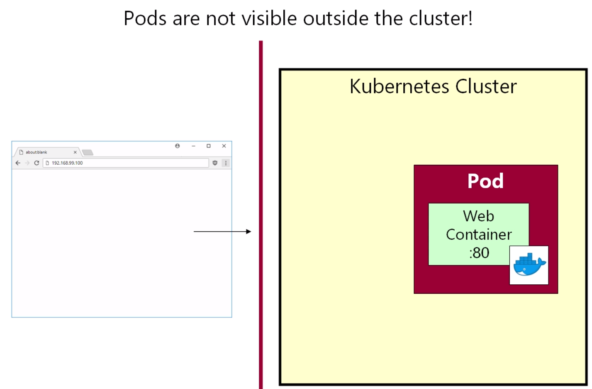

## 쿠버네티스 파드

***

Pod는 쿠버네티스의 가장 기본적인 개념 중 하나이다.  
가장 기본적이지만 설명하기는 어렵다.

파드의 정의는 다음과 같다.  
***두개 이상의 컨테이너로 이루어진 그룹***

파드에 대해서 더 설명하기 전에, 우리의 목표는 마이크로 서비스 
아키텍쳐를 클라우드 환경에 배포하는 것이다.  


위와 같이 web container를 비롯한 여러개의 마이크로 서비스가 있다고
가정해보자. 개발자들은 각 마이크로 서비스들을 도커 이미지 안에 포장시킨다.
그 후 AWS 같은 클라우드 시스템 안에서 노드를 작동시켜 접속한 다음
도커 명령어를 입력해 실행한다. 

쿠버네티스는 위 컨테이너들의 시작과 종료를 총괄한다.  
그리고 위와 같은 아키텍쳐를 조직하기 위해서 쿠버네티스는 여러 개의
개념들을 가지고 있다. 아래의 예시를 참고하자.
+ 레플리카 세트
+ 서비스
+ 스테이트풀 세트

이 중에서 가장 기본 개념이 포드이다.  
우리가 배포하려는 모든 컨테이너 들에게 각자 하나씩 포드를 만들어줄
예정이다. 


여기서 각 포드들은 컨테이너를 위한 일종의 포장지가 된다고 생각하면 
편하다. 

> 참고 :   
> 거의 모든 경우에서 포드와 컨테이너는 일대일의 관계를 가진다.  
> 하지만 항상 그런 것은 아니다.
> 첫번째 마이크로 서비스가 두번째 마이크로 서비스의 도움을 받을 
> 상황이 생길 수도 있기 때문이다.
> 
> 
> ex : 첫번째 마이크로 서비스가 수집한 로그를 어떻게든 가공해서
> 사용하고 싶은데 첫번째 마이크로 서비스에서는 로그를 가공할 수 없다면
> 위와 같은 구조로 두번째 마이크로 서비스가 해당 작업을 수행하게
> 설계할 수 있다.
> 
> 물론 저런 구조는 굉장히 일반적이지 않고, 우리가 저렇게 작업할 일은
> 거의 없다고 한다. 참고로 해당 구조의 컨테이너를 사이드카 컨테이너라고 한다.


그렇다면 왜 포드를 만들까???

***쿠버네티스는 포드를 관리한다***  
즉 포드는 쿠버네티스에서 가장 기본적으로 배포되는 유닛이라고 할 수 있다.


***

 ### Pod 만들어보기

파드나 서비스를 만들때 우리는 yaml을 작성해서 정의한다.

아래는 예시이다.

```yaml
apiVersion: v1
kind: Pod
metadata:
  name: webapp
spec:
  containers:
    - name: webapp
      image: richardchesterwood/k8s-fleetman-webapp-angular:release0
```
하나씩 살펴보면 다음과 같다.
+ apiVersion : 추후 업데이트 하겠음. 맨 윗줄에 존재해야 함.
+ kind: 정의하는 객체를 기입한다. 우리는 Pod를 만드므로 Pod로 기입.
+ metadata: Pod의 이름을 지정해준다. 이름은 없어선 안된다.
+ spec:
    + 객체(여기서는Pod)안에 넣고싶은 컨테이너를 정의한다. 
    + 여기서는 하나의 컨테이너만 만든다. (1 Pod 안에 1 Container)
    + 여기서 지어주는 컨테이너 이름이 도커의 컨테이너 이름이 된다.
    + name : 컨테이너의 이름을 명시한다.
    + image : 컨테이너가 어떤 이미지를 바탕으로 만들어질지 명시.
    

***

### Pod 실행해보기

터미널에서 yaml이 존재하는 디렉토리로 이동하자.  
그 후 가장 많이 쓰이는 명령어 중 하나인 ***kubectl get all***을 입력한다.


Pod를 포함해서 앞으로 우리가 만들게 될 모든 것들을 보여주는 명령어이다.
아무튼, 우리는 쿠버네티스에게 방금 만든 Pod를 클러스터에 배치하라고 
명령해야 한다.  
아래의 명령어가 해당 작업을 가능하게 해준다.  
***kubectl apply -f first-pod.yaml***


여기까지 됐다면, 우리는 처음으로 쿠버네티스 Pod를 클러스터에서 
실행시킨 것이다. 

> 하지만 여기서 minikube의 ip주소와 도커 컨테이너를 만들때 지정한
포트를 입력해주면, 웹사이트에 접속할 수 없다.(== 컨테이너를 실행할 수 없다?)
이유는 아래와 같다.
> + 쿠버네티스 Pod는 외부에서 확인될 수 없다.

> + 컨테이너는 Pod 내부에 있기 때문에 접근을 못함
> + Pod는 오직 클러스터 내부에서만 접근할 수 있다.  
> + 후에 나오게 될 Service 등의 개념과 함께 알아볼 것이라고 함


Pod를 실행시켰다면, 또 하나 알아야 할 중요한 명령어가 있다.

***kubectl describe pod [Pod name]***

```text
Name:             webapp
Namespace:        default
Priority:         0
Service Account:  default
Node:             minikube/192.168.49.2
Start Time:       Thu, 23 Mar 2023 22:31:46 +0900
Labels:           <none>
Annotations:      <none>
Status:           Running
IP:               10.244.0.7
IPs:
  IP:  10.244.0.7
Containers:
  webapp:
    Container ID:   docker://9863fa1a764bd1e6361794ba872de49614f8047b6e715674a7a37974a364a128
    Image:          richardchesterwood/k8s-fleetman-webapp-angular:release0
    Image ID:       docker-pullable://richardchesterwood/k8s-fleetman-webapp-angular@sha256:9b98fec20772bd1d7d4c9085048f28af35b31ad3a7b7d3ba395fb512c5c359e6
    Port:           <none>
    Host Port:      <none>
    State:          Running
      Started:      Thu, 23 Mar 2023 22:32:00 +0900
    Ready:          True
    Restart Count:  0
    Environment:    <none>
    Mounts:
      /var/run/secrets/kubernetes.io/serviceaccount from kube-api-access-ps6nm (ro)
Conditions:
  Type              Status
  Initialized       True
  Ready             True
  ContainersReady   True
  PodScheduled      True
Volumes:
  kube-api-access-ps6nm:
    Type:                    Projected (a volume that contains injected data from multiple sources)
    TokenExpirationSeconds:  3607
    ConfigMapName:           kube-root-ca.crt
    ConfigMapOptional:       <nil>
    DownwardAPI:             true
QoS Class:                   BestEffort
Node-Selectors:              <none>
Tolerations:                 node.kubernetes.io/not-ready:NoExecute op=Exists for 300s
                             node.kubernetes.io/unreachable:NoExecute op=Exists for 300s
Events:
  Type    Reason     Age   From               Message
  ----    ------     ----  ----               -------
  Normal  Scheduled  18m   default-scheduler  Successfully assigned default/webapp to minikube
  Normal  Pulling    18m   kubelet            Pulling image "richardchesterwood/k8s-fleetman-webapp-angular:release0"
  Normal  Pulled     17m   kubelet            Successfully pulled image "richardchesterwood/k8s-fleetman-webapp-angular:release0" in 13.6725145s (13.6725447s including waiting)
  Normal  Created    17m   kubelet            Created container webapp
  Normal  Started    17m   kubelet            Started container webapp
```

해당 명령어의 결과로 아주 방대한 양의 결과가 출력된다.  
여기서 우리가 주목할 부분은 가장 아래에 있는 Events 이다.  
Events에 있는 것들은 일종의 로그이며, Pod에 문제가 생겼다면 가장
먼저 봐야할 부분이기도 하다.  
***따라서 kubectl describe pod [Pod name] 명령어는 잘 숙지하자***

다음으로 Pod에 연결할 수 있는 명령어가 있다.

***kubectl exec ...***  
위 명령어를 통해서 Pod에 연결할 수 있는데, 예시를 보자.

+ kubectl exec webapp ls
  + webapp Pod의 안에 있는 컨테이너가 가지고 있는 루트 디렉토리 
  목록을 나열하고 싶을때 사용할 수 있는 명령어이다.
  + 즉 kubectl exec webapp 뒤의 명령어를 통해 webapp Pod의
  내부에 있는 컨테이너에 명령어를 전달할 수 있다.
  
    
같은 명령어로 다른 예시를 보겠다.

webapp Pod 내부의 컨테이너에 shell을 만들고, 그 쉘에 접근해서
명령어를 실행하는 코드이다.

+ kubectl -it exec webapp sh
  + -it : 텔레타입 에뮬레이션과 상호 작용하겠다
  + sh : shell을 만드는 명령어인듯 하다.
  


Pod 내부의 컨테이너 쉘에 접속한 뒤, 그 안에서 ls를 입력한 결과이다.

또한 아래 사진은 wget으로 http://localhost:80, 즉 실습에 사용한
웹페이지의 index.html을 다운받고 출력해본 것이다.


강의에서는 핵심을 다음과 같이 정의한다.

***웹서버는 Pod의 내부에 포함되며, 포드의 외부에서는 절대 
접근할 수 없다***

*** 
여기에 덧붙여, 내가 정리한 이번 섹션의 핵심은 다음과 같다.

kubectl 명령어를 통해서 우리는 Pod 내부에 들어있는 컨테이너에
접근했다. Pod에 넣기 전에는 컨테이너는 그저 도커 이미지를 컨테이너화
시킨 것에 불과했는데, Pod에 넣은 뒤부터 쿠버네티스의 명령어를 통해
실행/관리하는 것이 가능해졌다. Pod의 개념은 딱 이것이다.  

그런데 꼭 컨테이너를 Pod에 포함하지 않아도 쿠버네티스가 해당 컨테이너에
접근할 수 있는지 궁금해져서 gpt에게 물어보았다.


맥락이 좀 이상해서 잘 이해하지 못했다. 추후 공부해서 다시 알아보겠다.